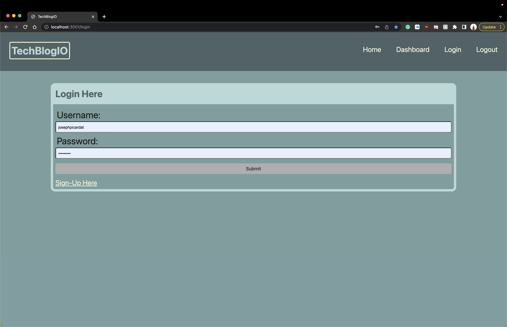

# TechBlogIO

## Description

What was my motivation?

- To understand handlebars

Why did I build this project?

- To be able to create a full stack application with login and storing data

What problem does it solve?

- This solves the problem of only having the data stored on users localstorage

What did I learn?

- I learned how to use handlebars and incorporate them with models and mysql

## Table of Contents

- [Installation](#installation)
- [Usage](#usage)
- [Questions](#questions)
- [License](#license)

## Installation

- Step 1: If installed locally, open up integrated terminal and type "npm install"
- Step 2: Once downloaded type 'mysql -u root -p' and login into mysql and type 'source db/schema.sql' to load the database
- Step 3: create an .env file and set your data for DB_NAME='tech_blog_db' DB_USER='root' DB_PASSWORD=
- Step 4: Go into the integrated terminal again and type 'npm start' to start the application

## Usage

Deployed Application: https://techblogio.herokuapp.com/

## Questions

Github Profile: josephpicardat

If you need to reach me, you can with through my email: josephpicardat1@gmail.com

## License

(https://opensource.org/licenses/MIT)

Copyright 2022 Joseph Picardat

Permission is hereby granted, free of charge, to any person obtaining a copy of this software and associated documentation files (the "Software"), to deal in the Software without restriction, including without limitation the rights to use, copy, modify, merge, publish, distribute, sublicense, and/or sell copies of the Software, and to permit persons to whom the Software is furnished to do so, subject to the following conditions:

    The above copyright notice and this permission notice shall be included in all copies or substantial portions of the Software.

    THE SOFTWARE IS PROVIDED "AS IS", WITHOUT WARRANTY OF ANY KIND, EXPRESS OR IMPLIED, INCLUDING BUT NOT LIMITED TO THE WARRANTIES OF MERCHANTABILITY, FITNESS FOR A PARTICULAR PURPOSE AND NONINFRINGEMENT. IN NO EVENT SHALL THE AUTHORS OR COPYRIGHT HOLDERS BE LIABLE FOR ANY CLAIM, DAMAGES OR OTHER LIABILITY, WHETHER IN AN ACTION OF CONTRACT, TORT OR OTHERWISE, ARISING FROM, OUT OF OR IN CONNECTION WITH THE SOFTWARE OR THE USE OR OTHER DEALINGS IN THE SOFTWARE.
